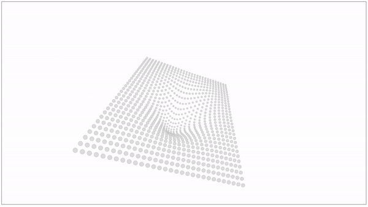
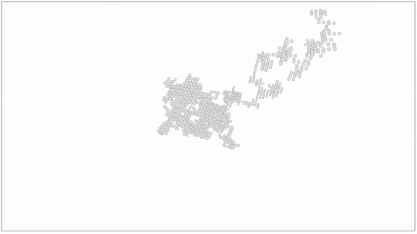
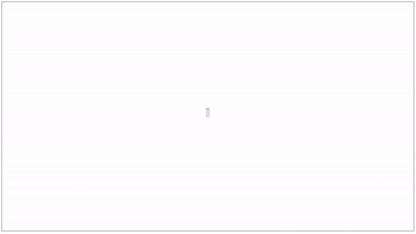

# D3DTS

## Synopsis

This is an [angular](https://angular.io/) App using [d3js](https://d3js.org/) and [d3-ng2-service](https://github.com/tomwanzek/d3-ng2-service) to draw svg elements in a three dimensional stage.

## Installation & Running the App

1. Clone this
2. Install [angular cli](https://github.com/angular/angular-cli)
3. npm install
4. ng serve
5. [http://localhost:4200](http://localhost:4200)

## Instructions

The stage is an angular component which has inputs for the camera position and rotation angles. The drawn objects are defined in a so-called 'world' (also an input of the stage) which includes sets of different Space Coordinates for different types (dot, path, text) and optional animation methods for the data as well as the camera position. Creating a new world can be done by deriving from the World Class and providing an instance of it to the stage. There are a couple of sample worlds included.

## Samples

